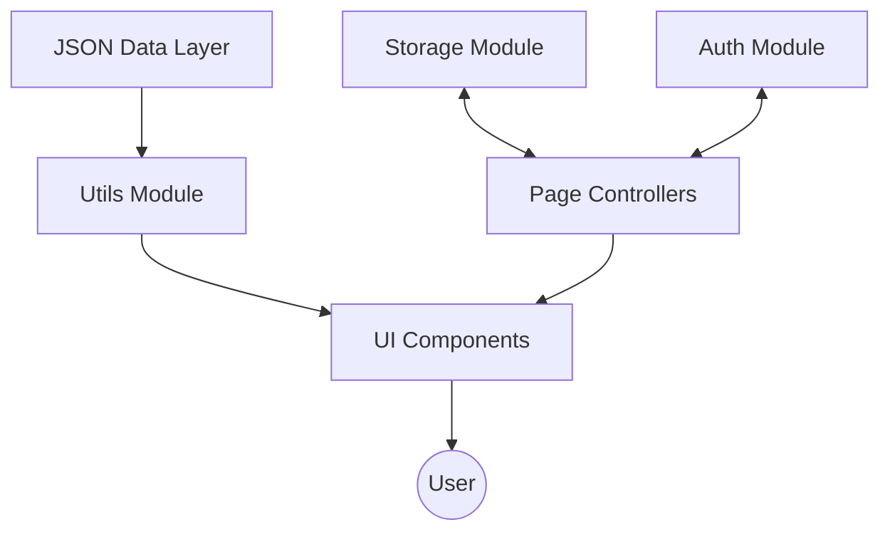

# Adobisphere

### Your Gateway to the Adobe Community Ecosystem

Adobisphere is a comprehensive, multi-page web platform designed to centralize Adobe-focused events, blogs, and creator profiles. It serves as a central hub for the community to discover content, register for events, and interact with creators through a seamless, unified experience.

This project is implemented as a sophisticated static site with a localized data layer, prioritizing architectural clarity, modular design, and robust state management.

## Key Features

### Authentication and User Management
- Secure user registration and login system.
- Password hashing using bcrypt.js for enhanced security.
- Comprehensive user profiles with editable details and avatar management.

### Content Discovery and Interaction
- Advanced Explore page with real-time search and multi-category filtering (Events, Blogs, Creators).
- Content saving system allowing users to bookmark blogs and events for later.
- Interactive blog comments and event registration workflows.

### Creator Ecosystem
- Dedicated creator profiles showcasing bios, social links, and associated content.
- Support for community-created blogs and event hosting.
- Dynamic data cross-referencing between creators, blogs, and events.

### Professional Blog Editor
- Block-based content editor for creating rich blog posts.
- Draft autosave and recovery system to prevent data loss.
- Content preview and publishing workflow.

## Technology Stack

The project leverages a modern vanilla technology stack to showcase core web development fundamentals without the overhead of heavy frameworks.

- **Frontend Core**: Vanilla HTML5, CSS3 (using custom properties for design tokens), and ES6+ JavaScript.
- **State and Persistence**: Browser `localStorage` and `sessionStorage` abstractions for session management and data persistence.
- **Data Layer**: Structured JSON files acting as a deterministic API-like data source.
- **Security**: bcrypt.js for client-side password hashing.
- **UI/UX**: Intersection Observer API for reveal-on-scroll animations and responsive mobile-first layouts.

## Folder Structure

```text
AdobeEcosystem/
├── index.html                 # Main Landing Page
├── pages/                     # Application Pages
│   ├── explore.html           # Search and Filtering Hub
│   ├── event.html             # Event Details and Registration
│   ├── blog.html              # Blog Post View
│   ├── blog-editor.html       # Content Creation Tool
│   ├── creator-profile.html   # Creator Portfolio View
│   ├── user-profile.html      # User Account Management
│   └── auth/                  # Login and Signup Flows
├── assets/                    # Static Assets (Images, Icons, Media)
├── data/                      # JSON Data Layer (Events, Blogs, Creators)
├── css/                       # Modular Stylesheets (Global + Page-specific)
└── js/                        # Application Logic (Modules + Controllers)
```

## Project Architecture

Adobisphere follows a modular architectural pattern where concerns are strictly separated between data, logic, and presentation.

### Architectural Overview



### Core Modules

- **`Storage` (window.Storage)**: A robust abstraction layer over `localStorage` and `sessionStorage`. It handles data serialization, key management, and provides a clean API for reading/writing user state and collections.
- **`Auth` (window.Auth)**: Centralized authentication logic. Manages user registration, login/logout flows, and maintains the global authentication state used by the navigation bar and protected actions.
- **`Utils` (window.Utils)**: A shared toolkit of helper functions for DOM manipulation, string formatting, URL parameter parsing, and reusable component builders (e.g., `buildEventCard`, `buildBlogCard`).
- **`Router` (window.Router)**: Manages URL-based navigation and parameter extraction, ensuring consistent routing behavior across the multi-page application.

## Getting Started

### Prerequisites

To run this project locally, you need a web server. Serving the files directly via `file://` will cause CORS errors when fetching the JSON data.

### Local Development Setup

1.  **Clone the Repository**:
    ```bash
    git clone https://github.com/your-username/Adobisphere.git
    cd Adobisphere
    ```

2.  **Serve the Application**:
    - **Option A (VS Code)**: Install the "Live Server" extension, right-click `index.html`, and select **Open with Live Server**.
    - **Option B (Node.js)**: Use a simple static server like `serve`:
      ```bash
      npx serve .
      ```
    - **Option C (Python)**: Use Python's built-in HTTP server:
      ```bash
      python -m http.server 8000
      ```

3.  **Access the Site**: Open your browser and navigate to `http://localhost:8000` (or the port provided by your server).

## Data Layer Schema

The application uses a deterministic data layer located in the `data/` directory. These JSON files are structured to mirror real-world API responses.

- **`campaigns.json`**: Contains detailed event data, including schedules, locations, and registration details.
- **`blogs.json`**: Stores blog post content, author metadata, and categorization.
- **`creators.json`**: Profiles of community members, including their bios, social links, and content cross-references.

## Project Roadmap

- **Backend Integration**: Transitioning from `localStorage` to a real database (e.g., MongoDB, PostgreSQL) with a RESTful or GraphQL API.
- **Multi-User Sync**: Implementing server-side sessions and data synchronization across devices.
- **Real-Time Notifications**: Adding a notification system for event updates and comment replies.
- **Enhanced Media Support**: Moving from Base64 images to cloud-based media storage (e.g., Cloudinary, S3).

## Known Limitations

- **Browser-Locked Persistence**: Data is stored locally in the browser; clearing site data will reset the application state.
- **Single-User Scope**: The application is designed for a single active user per browser session.
- **Static Hosting Requirement**: Internal links and data fetching depend on being served from a web root.

---

Built with passion for the Adobe Community.
